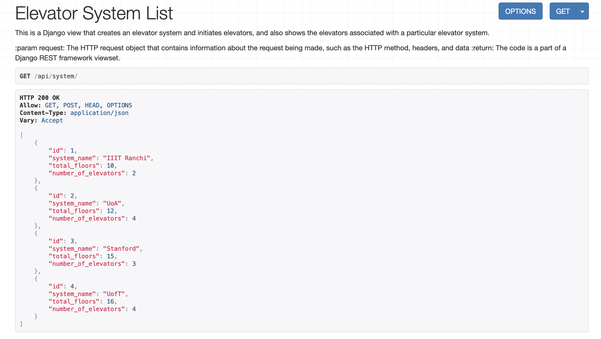

# [Elevate.api](https://youtu.be/ZZZ9MB3WszQ)

[](https://youtu.be/ZZZ9MB3WszQ)

A simplified `elevator model` in Python. We'll ignore a lot of what goes into a real world elevator, like physics, maintenance overrides, and optimizations for traffic patterns. Main feature is to decide whether the elevator should go up, go down, or stop. 

This is built using Python & Django (`Django Rest Framework` specifically with ViewSets, Serializers etc) using `PostgreSQL` as database.

An elevator system, which can be initialised with N elevators and maintains the elevator states as well. 

## Installation : 
1. Make a python virtual enviornment in your preferred system

2. Clone the repo and navigate to the directory where the manage.py file is located
```
git clone https://github.com/kaustubh-s1/Elevate.api.git
```
```
cd Elevate.api
```

3. Install the requirements
```
pip install -r requirements.txt
```
4. Run the development server
```
python manage.py runserver
```

5. The elevator is running in a different thread and processes all the requests immediately. Check `utils/move_elevator.py` and `src/apps.py` to know more details.

6. sqlite3 DB is used for development phase. Postgres integration has also been performed.
```
DATABASES = {
   'default': {
       'ENGINE': 'django.db.backends.postgresql',
       'NAME': ‘<database_name>’,
       'USER': '<database_username>',
       'PASSWORD': '<password>',
       'HOST': '<database_hostname_or_ip>',
       'PORT': '<database_port>',
   }
}
```

4. Please check the models representation and API endpoints at [APIs.md](https://github.com/kaustubh-s1/Elevate.api/main/DOCS.md)